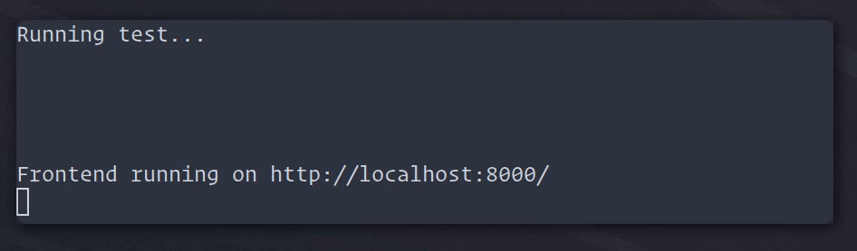

# Obelisk + PostCSS + Tailwind CSS
[![Obelisk](https://img.shields.io/badge/Powered%20By-Obelisk-black?style=flat&logo=data:image/svg+xml;base64,PHN2ZyB4bWxucz0iaHR0cDovL3d3dy53My5vcmcvMjAwMC9zdmciIHdpZHRoPSI3NjgiIGhlaWdodD0iNzY4Ij48ZyBmaWxsLXJ1bGU9ImV2ZW5vZGQiPjxwYXRoIGQ9Ik0zMDUuODggNjIyLjY3M2MtMzcuOTI0LTEyLjM4Ni03MS44NzMtMzMuNTU2LTk5LjQzNS02MS4xMThDMTYxLjAyIDUxNi4xMjkgMTMyLjk1MiA0NTMuMzQ0IDEzMi45NTIgMzg0YzAtNjkuMjU3IDI4LjA2Ny0xMzIuMTMgNzMuNDkzLTE3Ny41NTVDMjUxLjg3MSAxNjEuMDIgMzE0LjY1NiAxMzIuOTUyIDM4NCAxMzIuOTUyYzY5LjM0NCAwIDEzMi4xMyAyOC4wNjcgMTc3LjU1NSA3My40OTNDNjA2Ljk4IDI1MS44NzEgNjM1LjA0OCAzMTQuNzQzIDYzNS4wNDggMzg0YzAgNjkuMzQ0LTI4LjA2NyAxMzIuMTMtNzMuNDkzIDE3Ny41NTVDNTE2LjEyOSA2MDYuOTggNDUzLjM0NCA2MzUuMDQ4IDM4NCA2MzUuMDQ4VjE2MS4zNWwtMzkuNjEgMzIuMDU2LTM4LjUxIDQyOS4yNjYiIGZpbGw9IiMyZDMyM2IiLz48cGF0aCBkPSJNMzg0IDYwNi42NDdjNjEuNDk5IDAgMTE3LjE3OS0yNC44OTUgMTU3LjQ2NS02NS4xODJDNTgxLjc1MiA1MDEuMTggNjA2LjY0NyA0NDUuNSA2MDYuNjQ3IDM4NGMwLTYxLjQyNS0yNC44OTUtMTE3LjE3OS02NS4xODItMTU3LjQ2NUM1MDEuMTggMTg2LjI0OCA0NDUuNSAxNjEuMzUzIDM4NCAxNjEuMzUzdjQ0NS4yOTQiIGZpbGw9IiM3MDllYjUiLz48cGF0aCBkPSJNMzg0IDYzNS4wNDhjMjYuOTkgMCA1My41NjQtNC4yMzYgNzkuMjI1LTEyLjc5TDQyMy42MTMgMTkzLjQxIDM4NCAxNjEuMzUzdjQ3My42OTUiIGZpbGw9IiMyZDMyM2IiLz48L2c+PC9zdmc+)](https://github.com/obsidiansystems/obelisk)

_Using modern css tooling with Obelisk._



This repository is an example of how one can use Obelisk with a css processor/compiler. We're specifically going to be setting up PostCSS and Tailwind CSS.

We'll be putting together a nix expression that runs the postcss compiler with the tailwind plugin on our input css file. This nix expression will be supplied to our Obelisk application as the generator for our application's static files. As we modify our application (code or stylesheets), Obelisk's `ob run` command will automatically regenerate the static assets when needed.

## Setting up the node project

We'll set up a simple Tailwind/PostCSS project, as described [here](https://tailwindcss.com/docs/installation#installing-tailwind-css-as-a-post-css-plugin).

First, let's create a folder `static/src` in our Obelisk project:

```bash
mkdir -p static/src
cd static/src
```

### `package.json`

Here's a `packages.json` specifying our dependencies, including tailwindcss, the tailwind ui plugin, and the autoprefixer postcss plugin:

```json
{
  "name": "styles",
  "version": "0.0.0",
  "author": "Obsidian Systems, LLC",
  "dependencies": {
    "@tailwindcss/ui": "^0.4.0",
    "autoprefixer": "^9.8.5",
    "postcss-cli": "^7.1.1",
    "postcss-import": "^12.0.1",
    "tailwindcss": "^1.5.1",
    "cssnano": "^4.1.10"
  }
}
```

### `postcss.config.js`

We'll also create a simple PostCSS configuration file (`postcss.config.js`):

```javascript
module.exports = {
  plugins: {
    tailwindcss: {},
    autoprefixer: {},
    cssnano: {}
  }
}
```

### `tailwind.config.js`

Next, we'll write a basic tailwind configuration file (`tailwind.config.js`):

```javascript
module.exports = {
  purge: {
    enabled: true,
    content: ['./frontend/**/*.hs']
  },
  darkMode: false,
  theme: {
    extend: {},
  },
  variants: {},
  plugins: [],
}
```

Note that the tailwind file refers to `./frontend/**/*.hs`: tailwind will read the our frontend haskell source files looking for references to tailwind classes so that it can purge unneeded classes from the generated CSS. However, for this to work, we'll have to provide 

### `styles.css`

Finally, we'll write a basic tailwind stylesheet:

```css
@tailwind base;
@tailwind components;
@tailwind utilities;
```

### Nix-ifying the node project

We'll use the `node2nix` command to generate nix expressions for our node project. This will lock down our dependencies and make it possible to compile our css files in a nix build.

```bash
cd static/src
nix-shell -p nodePackages.node2nix --run node2nix
```

This repository also includes a `node2nix.nix` file, in case the version of nixpkgs you're using doesn't include node2nix.

```nix
(import (builtins.fetchTarball {
   name = "nixpkgs-unstable_2020-11-18";
   url = "https://github.com/nixos/nixpkgs/archive/4f3475b113c93d204992838aecafa89b1b3ccfde.tar.gz";
   sha256 = "158iik656ds6i6pc672w54cnph4d44d0a218dkq6npzrbhd3vvbg";
 }) {}).nodePackages.node2nix
```

You can use `node2nix.nix` by running:

```bash
$(nix-build node2nix.nix)/bin/node2nix
```

node2nix will generate a few different nix files. You won't have to re-run node2nix unless you change the contents of `package.json`.

## Adding the static files derivation

Now that we've nixified the Tailwind, PostCSS and their dependencies, we can write a nix expression that will actually build the css files (and other static assets) for our project using the node project as an input.

We'll put this code in `static/default.nix`:

```nix
{ pkgs }:
let
  # The nixified node project was generated from a package.json file in src using node2nix
  # See https://github.com/svanderburg/node2nix#using-the-nodejs-environment-in-other-nix-derivations
  nodePkgs = (pkgs.callPackage ./src {}).shell.nodeDependencies;
  
  # The frontend source files have to be passed in so that tailwind's purge option works
  # See https://tailwindcss.com/docs/optimizing-for-production#removing-unused-css
  frontendSrcFiles = ../frontend;
  
in pkgs.stdenv.mkDerivation {
  name = "static";
  src = ./src;
  buildInputs = [pkgs.nodejs];
  installPhase = ''
    mkdir -p $out/css
    mkdir -p $out/images
    
    # Setting up the node environment:
    ln -s ${nodePkgs}/lib/node_modules ./node_modules
    export PATH="${nodePkgs}/bin:$PATH"
    
    # We make the frontend haskell source files available here:
    # This corresponds to the path specified in tailwind.config.js
    ln -s ${frontendSrcFiles} frontend
    
    # Run the postcss compiler:
    postcss css/styles.css -o $out/styles.css
    
    # We can write other commands to produce more static files as well:
    cp -r images/* $out/images/
  '';
}
```

## Telling Obelisk to use the static files derivation

In your Obelisk project's `default.nix`, set the `staticFiles` option to the nix derivation you created above:

```nix
{ system ? builtins.currentSystem
, obelisk ? import ./.obelisk/impl {
    inherit system;
    iosSdkVersion = "13.2";
  }
}:
with obelisk;
project ./. ({ pkgs, ... }: {
  staticFiles = import ./static { inherit pkgs; };
  android.applicationId = "systems.obsidian.obelisk.examples.tailwind";
  android.displayName = "Obelisk + Tailwind CSS";
  ios.bundleIdentifier = "systems.obsidian.obelisk.examples.tailwind";
  ios.bundleName = "Obelisk + Tailwind CSS";
})
```

## Using `ob run`

Whenever you change a frontend file or modify something in `static/` that would have an impact on the static files derivation, you'll see the following messages in the `ob run` console:

```
Static assets being built...
Static assets built and symlinked to static.out
```

That's also where you'll see errors related to the compilation of static files.

Note that changing frontend files doesn't have to, in principle, cause a rebuild of the static files. In our case it does because we're using the Tailwind CSS purge functionality.

***

Thanks to Emre Can for the [photo used in this example](https://www.pexels.com/photo/architectural-photography-of-obelisk-2079658/).
